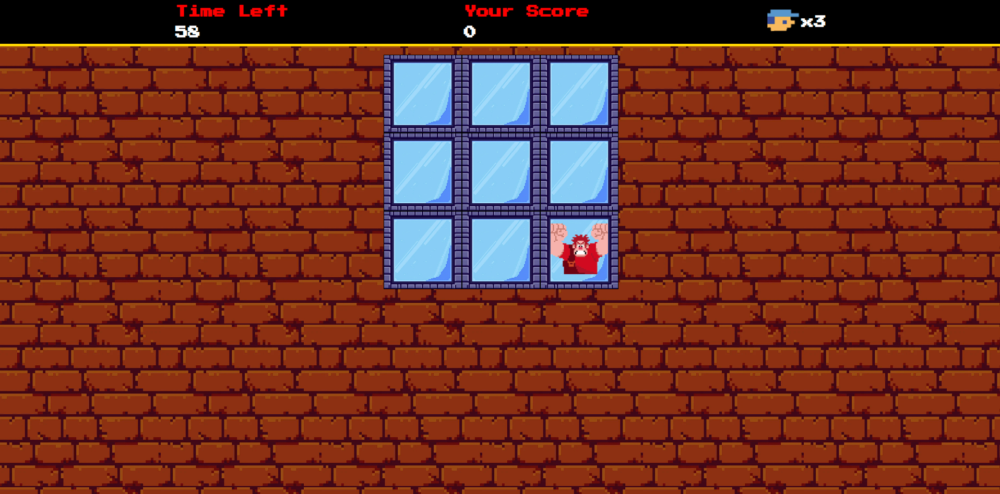

# Wreck-It Ralph Game
> DIO Challenge - Creating a Wreck-It Ralph Game with JavaScript

## 📋 Index

- [📖 About](#-About)
- [👨🏻‍💻 Technologies ](#-Technologies)
- [🖥 Preview](#-Preview)
- [📌 Credits](#-Credits)

## 📖 About
Project developed during Bootcamp [Ri Happy - Front-end do Zero](https://web.dio.me/track/coding-future-front-end-do-zero) with professor [Felipe Aguiar](https://github.com/felipeAguiarCode). The game is based on the film Wreck-It Ralph. Three difficulties are presented: "Easy, "Medium and "Fix It Félix", the objective of the game is to be able to hit Ralph who keeps changing windows as many times as possible, when he is hit the score increases.

## 👨🏻‍💻 Technologies

## 🖥 Preview:

  
  

## 📌 Credits:
  -Assets from the repository: [digitalinnovationone/jsgame-detona-ralph](https://github.com/digitalinnovationone/jsgame-detona-ralph)

## Português

# Jogo do Detona-Ralph
> Desafio DIO - Criando um Jogo do Detona Ralph com JavaScript

## 📋 Índice

- [📖 Sobre](#-Sobre)
- [👨🏻‍💻 Linguagens utilizadas](#-Linguagens-utilizadas)
- [🖥 Preview](#-Preview)
- [📌 Créditos](#-Créditos)

## 📖 Sobre
Projeto desenvolvido durante o Bootcamp [Ri Happy - Front-end do Zero](https://web.dio.me/track/coding-future-front-end-do-zero) com o professor [Felipe Aguiar](https://github.com/felipeAguiarCode). O jogo é baseado no filme Detona Ralph. São apresentadas três dificuldades: "Fácil, "Médio e "Fix It Félix", o objetivo do jogo é conseguir acertar o Ralph que fica mudando de janela o máximo de vezes, quando ele é acertado a pontuação aumenta.

## 👨🏻‍💻 Linguagens utilizadas

## 🖥 Preview:

  
  

## 📌 Créditos:
  - Assets retirados do repositório: [digitalinnovationone/jsgame-detona-ralph](https://github.com/digitalinnovationone/jsgame-detona-ralph)
